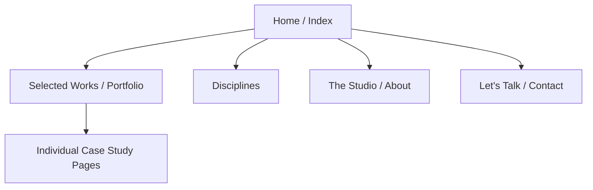

# MASTER ARCHITECTURE BLUEPRINT: Awwwards-Level Creative Agency

## 1. Executive Summary
This document serves as the master build specification and architectural blueprint for the Unnamed Creative Agency's 2026 digital presence. Designed to act as the single source of truth for founders, designers, and developers, this blueprint details the creation of a premium, cinematic, and highly interactive digital experience. The platform will not merely list services; it will prove mastery through its own execution. By combining elite-level motion design, rigorous typography, and an uncompromising performance standard, the site will convert high-value international and local clients across four core verticals: Portfolio Design, Packaging, Photography, and Web Development.

---

## 2. Brand and Product Strategy

### Brand Positioning
- **The Stance:** "We don't just design. We build narratives that demand attention."
- **The Vibe:** Unapologetic aesthetic excellence paired with meticulous strategy. The brand feels scarce, highly sought-after, and expensive.
- **Differentiation:** We are not a template agency. We bridge the gap between profound artistic beauty and hardcore business conversion. 

### Market Positioning
Targeting founders, marketing directors, and event planners who are visually literate and demanding. They don't want a vendor; they want a creative partner who can elevate their brand to international luxury standards.

### Conversion Goals & Trust Strategy
- **Primary Goal:** High-ticket inquiry generation via the "Let's Talk" / Contact flow.
- **Trust Mechanisms:** 
  - *Show, Don't Tell:* The site's own micro-interactions and performance are the primary case study.
  - *Curated Case Studies:* Deep-dive project breakdowns highlighting process, not just final images.
  - *Micro-copy:* Confident, brief, and definitive statements.

---

## 3. Product Requirements Document (PRD)

### Problem Statement
Premium clients struggle to find agencies that can execute both high-end physical branding (packaging/print portfolios) and elite digital experiences (web). Existing agency sites either look beautiful but fail to convert, or convert well but look cheap.

### Solution Summary
A cinematic, scroll-driven digital flagship that seamlessly integrates the agency's multidisciplinary services into one cohesive, luxury narrative, backed by a modern, headless tech stack for ultimate performance.

### Target Audience & User Personas
1. **The Visionary Founder:** Needs a complete brand and web overhaul. Low time, high budget. Looking for instant proof of taste.
2. **The Luxury Event Planner:** Needs exquisite, physical pitch decks and event portfolios. Values tactile aesthetics translated to digital.
3. **The Brand Director:** Seeking packaging and campaign photography. Needs to see structural concepts and high-impact imagery.

### Business Goals & Success Metrics
- **Goal:** Win Site of the Day (Awwwards/FWA) within 3 months of launch.
- **Metric:** LCP < 1.5s, 0 Layout Shift, 100% Lighthouse Accessibility score.
- **Metric:** 4%+ conversion rate from unique visitor to qualified inquiry.

### Scope & Feature Requirements
- **In-Scope:** Immersive Home page, dynamic Portfolio grid with filtering, deep-dive Case Study template, About/Studio page, high-conversion Contact section, custom cursor, smooth scrolling, headless CMS integration.
- **Out-of-Scope (Phase 1):** Client login portals, e-commerce, automated booking calendars (keep inquiries high-touch).

---

## 4. Information Architecture and Sitemap

### Sitemap

### Page-by-Page Structure
1. **Home (`/`):**
   - Preloader (Brand reveal)
   - Hero (Parallax background, massive staggered typography)
   - Studio Thesis (Short, punchy statement of intent)
   - Disciplines Overview (Interactive hover-reveal list of 4 services)
   - Featured Works (Curated horizontal scroll or masonry grid)
   - Monolithic Footer CTA ("Let's Talk")

2. **Selected Works (`/work`):**
   - Dynamic Grid with WebGL distortion on image hover.
   - Fluid category filtering (All, Web, Branding, Photo, Event).

3. **Case Study (`/work/[slug]`):**
   - Immersive hero image/video.
   - "The Ask" vs "The Execution" text breakdown.
   - Full-bleed imagery, staggered image grids, video loops.
   - "Next Project" sticky footer.

---

## 5. UX and UI Design Documentation

### Visual Direction & Art Direction
- **Theme:** "Dark Editorial" or "High-Contrast Light". Let's define the primary mode as **High-Contrast Light** with deep charcoal accents, utilizing negative space heavily.
- **Grid System:** 12-column fluid grid. Gutters: 24px (desktop), 16px (mobile). Margins: 5vw.

### Color System
- **Background:** `#F6F5F2` (Off-white canvas)
- **Primary Text/Accents:** `#0B0B0B` (Deep Charcoal)
- **Interactive Highlight:** `#FF4500` (Vibrant Vermilion/Coral) or `#C4A484` (Muted Gold) depending on specific brand asset.
- **Surfaces:** Glassmorphism (`rgba(255,255,255,0.7)`) with heavy background blur (`20px`) for floating elements.

### Typography System
- **Display (Headings):** *Playfair Display*, *Ogg*, or *PP Editorial New*. Used massively, often overlapping or breaking grid intentionally.
- **Sans (Body/UI):** *Inter*, *Neue Montreal*, or *Satoshi*. Highly legible, tight tracking for UI elements, open leading for body copy.

### Component Design Principles
- **Buttons:** Pill-shaped, magnetic pull on hover, inner text rolls up and replaces itself.
- **Cards:** Borderless. Rely on shadow and scale for depth. On hover, imagery saturates and scales slightly.
- **Navigation:** Floating pill, disappears on scroll down, reappears on scroll up.

---

## 6. Motion and Interaction System

### Motion Philosophy
"Fluid, Physics-based, Intentional." No linear easings. Everything must feel like it has weight and momentum.

### Easing System
- **Primary Ease:** Custom cubic-bezier (`0.7, 0, 0.3, 1`) for structural movements.
- **Snappy Ease:** Custom cubic-bezier (`0.34, 1.56, 0.64, 1`) for micro-interactions (buttons, cursor).

### Specific Patterns
- **Scroll Behavior:** Momentum scrolling via Lenis.
- **Cursor:** Custom dot (`mix-blend-difference`). Expands to enclose "VIEW" or "DRAG" when hovering over media.
- **Reveal Patterns:** Text lines stagger up from a hidden mask (`y: 100% -> 0`). Images unmask using a clip-path sweep.
- **Page Transitions:** Immediate exit animations, brief loading overlay, staggered entrance on the new page.

### Reduced Motion
- Strictly obey `prefers-reduced-motion`. Disable Lenis smooth scroll, replace complex GSAP timelines with simple opacity fades, default cursor to OS standard.

---

## 7. Technical Stack and Architecture

### Stack Definition
- **Frontend Framework:** Next.js (App Router, React 19).
- **Styling:** Tailwind CSS v4 (Utility-first, heavily customized via theme variables).
- **Motion/Animation:** GSAP (ScrollTrigger, Flip), Framer Motion (AnimatePresence, Layout transitions), Lenis (Smooth Scroll).
- **CMS:** Sanity.io (Real-time collaborative editing, precise schema control).
- **Hosting/Deployment:** Vercel (Edge caching, serverless functions).
- **Assets/Images:** Cloudflare Image Resizing / Next/Image (WebP/AVIF delivery).

### Architecture Flow
`Sanity Studio (Content)` -> `GROQ Queries` -> `Next.js (SSG/ISR)` -> `Vercel Edge Network` -> `Client Browser`.

### Security & Scaling
- Environment variables secured in Vercel.
- API routes rate-limited.
- Static generation ensures the site can handle massive traffic spikes without backend failure.

---

## 8. Content Strategy and Copy Framework

### Brand Voice Rules
- **Rule 1:** Be definitive. Say "We build" not "We strive to build".
- **Rule 2:** Less is more. Let the typography and imagery breathe.
- **Rule 3:** Focus on the outcome. 

### Key Messaging
- **Hero:** "Crafting Digital Masterpieces."
- **Services:** "Disciplines of Excellence."
- **Contact:** "Let's create something extraordinary."

---

## 9. CMS and Content Modeling (Sanity.io)

### Core Schemas
1. **`project` document:**
   - `title` (String)
   - `slug` (Slug)
   - `client` (String)
   - `services` (Array of Strings: Web, Branding, etc.)
   - `mainImage` (Image with Hotspot)
   - `gallery` (Array of Images/Videos)
   - `challenge` (Portable Text)
   - `solution` (Portable Text)
2. **`service` document:**
   - `title` (String)
   - `description` (Text)
   - `icon` (SVG/String)

---

## 10. Performance, Accessibility, SEO, and Security

### Performance Strategy
- **Budget:** Max initial JS payload < 200kb gzipped.
- **Execution:** Dynamic imports for heavy animation libraries (Three.js if used later). Font subsetting and preloading. Next/Image for all media.

### Accessibility (a11y)
- Semantic HTML (`<main>`, `<section>`, `<nav>`).
- Hidden `<h1>` tags if visual design dictates graphic text.
- `aria-hidden="true"` on purely decorative animated SVGs.
- Focus trapping inside modals/mobile menus.

### SEO Implementation
- Dynamic `<title>` and `<meta>` generation per case study.
- JSON-LD Structured Data (Organization, Portfolio).
- Clean semantic URLs (`/work/project-name`).

---

## 11. Analytics and Monitoring

- **Analytics:** Plausible Analytics or Fathom (Privacy-first, cookie-less, won't bloat the JS bundle like GA4).
- **Error Tracking:** Sentry (Catches React boundary errors and Next.js API route failures).
- **Web Vitals:** Vercel Analytics (Real User Monitoring for LCP, CLS, INP).

---

## 12. Development Workflow and Delivery Plan

### Phases
- **Phase 1: Architecture & Scaffold (Week 1)**
  - Setup Next.js, Tailwind, Linters, Husky.
  - Setup Sanity CMS and connect schemas.
- **Phase 2: Structural UI & Routing (Week 2)**
  - Build layout, grid, typography system, and static components.
  - Connect Sanity data to Next.js templates.
- **Phase 3: The Motion Layer (Week 3)**
  - Implement Lenis, Custom Cursor, Preloader.
  - Add GSAP ScrollTriggers and Framer Motion page transitions.
- **Phase 4: Polish, QA, & Launch (Week 4)**
  - Cross-browser testing, mobile optimization, Lighthouse audits.

### Handoff Checklist
- [ ] Figma tokens perfectly map to `tailwind.config` / `globals.css`.
- [ ] All assets compressed and loaded into CMS/CDN.

---

## 13. Risks, Constraints, and Assumptions

- **Risk:** High-end animations degrade performance on low-tier mobile devices.
  - *Mitigation:* Disable complex WebGL/GSAP on mobile breakpoints. Serve static fallbacks.
- **Assumption:** Client will provide high-resolution, professionally shot imagery. If client imagery is poor, the design will fail.
- **Constraint:** React 19 / Next.js 15 App Router requires strict 'use client' boundaries for animation libraries.

---

## 14. Launch Readiness Checklist

- [ ] Lighthouse scores: Perf > 90, A11y 100, SEO 100, Best Practices 100.
- [ ] Forms connected to production email/CRM and tested.
- [ ] `prefers-reduced-motion` verified on OS level.
- [ ] Open Graph (OG) images generated and tested for Twitter/LinkedIn sharing.
- [ ] 301 Redirects mapped if migrating from an old domain.
- [ ] Sentry error monitoring active in production.
- [ ] Final visual QA by Creative Director on 4k display and latest iPhone.

---
*End of Document. Prepared for 2026 Elite Launch Standard.*
