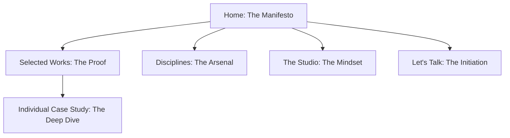

# THE MASTER BLUEPRINT: Engineering Digital Prestige

## 1. Executive Summary & The Manifesto
We do not build websites; we engineer digital monopolies. This document is the uncompromising architectural blueprint for the Unnamed Creative Agency’s 2026 digital flagship. It is written for founders who demand market dominance, designers who obsess over the sub-pixel, and engineers who build for absolute performance.

The internet is drowning in templates and generic "startup" aesthetics. Our platform will be the antidote. It will be a cinematic, highly tactile, award-winning experience that proves our mastery before the client even reads a word. By fusing elite motion design, rigorous typography, and a zero-compromise technical stack, we will convert high-value global clients across Portfolio Design, Packaging, Photography, and Web Development. This is not a brochure. It is a high-performance conversion engine disguised as art.

---

## 2. Brand & Product Strategy

### Brand Positioning: The Unfair Advantage
- **The Stance:** "We architect visual authority. Your brand is either unforgettable, or it is invisible."
- **The Vibe:** Authoritative, deeply cinematic, scarce, and expensive. We speak with the quiet confidence of a studio that has nothing to prove but everything to show.
- **Differentiation:** We reject the false dichotomy between "beautiful" and "converting." We believe that profound aesthetic rigor *is* the ultimate conversion lever. We are the bridge between tactile artisan craft (packaging/portfolios) and elite digital execution.

### Market Positioning & The Value Proposition
We target visionary founders, luxury marketing directors, and elite event planners. They are fatigued by agencies that over-promise and under-deliver. They are looking for a partner with flawless taste and the technical muscle to execute it globally. Our value proposition is simple: We make your brand look like the undisputed leader of your category.

### Conversion Architecture & Trust Strategy
- **Primary Goal:** Generate high-ticket, pre-qualified inquiries via a frictionless, high-touch "Let's Talk" flow.
- **Trust Mechanisms:**
  - *Proof Through Execution:* The website's own performance, micro-interactions, and spatial rhythm are our ultimate case study.
  - *Surgical Case Studies:* We don’t just show pretty pictures; we document the strategic problem and the aesthetic triumph.
  - *Authoritative Micro-copy:* No fluff. Just sharp, definitive statements of value.

---

## 3. Product Requirements Document (PRD)

### The Problem in the Market
High-net-worth clients are forced to choose between boutique design shops that cannot code, and massive tech agencies that lack artistic soul. Existing agency sites are either beautiful, broken, and slow—or fast, functional, and deeply boring.

### The Solution
A scroll-driven, cinematic digital flagship that behaves like native software but feels like a high-end editorial magazine. It seamlessly integrates multidisciplinary services into one luxury narrative, backed by a modern headless architecture for instant load times.

### User Personas
1. **The Visionary Founder (Tech/DTC):** Low time, massive ambition. Needs a complete brand and digital ecosystem. Judges instantly on typography, load speed, and motion design.
2. **The Luxury Event Architect:** Values the physical and tactile. Needs exquisite pitch decks and event branding. Looking for a digital agency that understands print-level detail.
3. **The Global Brand Director:** Needs packaging concepts and campaign photography. Requires structural brilliance and high-impact visual storytelling.

### Business Goals & Success Metrics
- **Brand Authority:** Secure Site of the Day (Awwwards/FWA) within 3 months of launch.
- **Engineering Excellence:** Core Web Vitals perfection (LCP < 1.5s, 0 CLS) and 100% Lighthouse Accessibility.
- **Revenue Impact:** 5%+ conversion rate from unique target visitor to qualified, high-ticket inquiry.

### Scope Definition
- **In-Scope (The Flagship):** Immersive Home experience, dynamic WebGL-enhanced Portfolio grid, deep-dive Editorial Case Studies, Studio/About manifesto, high-conversion Contact architecture, custom interactive cursor, momentum scrolling, and full headless CMS integration.
- **Out-of-Scope (Phase 1):** E-commerce, client login portals, automated booking calendars (we require high-touch human curation for leads).

---

## 4. Information Architecture and Spatial Logic

### Sitemap

### Section-by-Section Hierarchy
1. **Home (`/`): The Initiation**
   - **The Preloader:** A dramatic, tension-building brand reveal.
   - **The Hero:** Parallax depth, massive staggered typography that demands reading.
   - **The Thesis:** A short, punchy manifesto on why design is a business multiplier.
   - **The Disciplines:** Interactive, hover-reveal list of 4 services (tactile, immediate feedback).
   - **The Proof:** Curated featured works in a dynamic grid.
   - **The Monolith:** A massive, unmissable Footer CTA ("Let's Talk").

2. **Selected Works (`/work`): The Gallery**
   - Fluid category filtering (All, Web, Branding, Photo, Event) without page reloads.
   - Image hovers trigger subtle WebGL distortion or deep saturation shifts.

3. **Case Study (`/work/[slug]`): The Autopsy**
   - Immersive, full-viewport hero media.
   - "The Ask" vs "The Execution" dual-column text breakdown.
   - Full-bleed imagery, staggered grids, and looping video assets.
   - Sticky "Next Project" footer to trap users in a loop of awe.

---

## 5. UX and UI Design Documentation: The Aesthetic Code

### Visual Direction: "High-Contrast Editorial"
We reject clutter. We embrace the luxury of negative space. The design relies on severe contrast, massive scale shifts, and flawless typographic pairing to create a sense of digital haute couture.

### The Grid & Spatial System
- **Grid:** 12-column fluid grid.
- **Gutters:** 24px (desktop), 16px (mobile).
- **Whitespace:** Treated as a primary design element. Margins and paddings are expansive, allowing content to breathe and command focus.

### The Color System
- **The Canvas:** `#F6F5F2` (Off-white, paper-like warmth. Never pure white).
- **The Ink:** `#0A0A0A` (Deepest Charcoal. Never pure black, to reduce eye strain while maintaining severity).
- **The Accent:** `#FF4500` (Vibrant Vermilion) or `#C4A484` (Muted Gold). Used surgically for interactive states and primary CTAs.
- **The Glass:** Backdrop-blurred surfaces (`rgba(255,255,255,0.6)` with `20px` blur) for floating navigation to maintain depth.

### Typography System: The Voice
- **Display (Headings):** *Playfair Display* (or *Ogg* / *PP Editorial New*). Used at massive scales. We intentionally let typography overlap or break the grid to create artistic tension.
- **Sans (Body/UI):** *Inter* (or *Neue Montreal*). Highly legible, brutalist, and structured. Tight tracking for UI elements, open leading for body copy for maximum cognitive ease.

### Component & Interaction Principles
- **The Anti-Button:** No generic rectangles. Buttons are pill-shaped, feature magnetic pull on hover, and text rolls vertically to indicate action readiness.
- **Cards:** Borderless. Depth is achieved through scale and shadow on interaction. Hovering an image saturates it and scales it by 1.05x inside an `overflow-hidden` mask.
- **Navigation:** A floating glass pill. It disappears on scroll down to maximize the viewport, and instantly reappears on scroll up.

---

## 6. Motion and Interaction System: The Choreography

### Motion Philosophy
"Fluid, Physics-based, Inevitable." Nothing snaps linearly. Everything has mass, momentum, and friction. Motion is not decorative; it directs the user's eye and rewards their curiosity.

### The Easing System
- **Structural Ease:** Custom cubic-bezier (`0.7, 0, 0.3, 1`). Used for page transitions, large image reveals, and structural shifts. Feels deliberate and cinematic.
- **Snappy Ease:** Custom cubic-bezier (`0.34, 1.56, 0.64, 1`). Used for micro-interactions (buttons, cursors, toggles). Feels highly responsive and tactile.

### The Interaction Arsenal
- **Momentum Scrolling:** Utilizing Lenis to detatch scrolling from the OS, creating a buttery, weightless glide through the content.
- **The Cursor:** A custom dot (`mix-blend-difference`) that trails the mouse. It expands drastically to enclose text like "VIEW" or "DRAG" when hovering over media, turning the cursor into an interactive tool.
- **Reveal Patterns:**
  - *Kinetic Type:* Text lines stagger up from invisible masks (`y: 100% -> 0`).
  - *Media Sweeps:* Images unmask using directional clip-paths, moving slower than the scroll to create parallax depth.
- **Page Transitions:** Immediate exit animations, a brief branded loading overlay, and a staggered, choreographed entrance on the new route. No white flashes.

### Accessibility: Reduced Motion
We respect user preferences. If `prefers-reduced-motion` is detected, we strip the momentum scroll, convert complex GSAP timelines to elegant opacity fades, and revert to the native OS cursor.

---

## 7. Technical Stack and Architecture: Zero-Compromise Engineering

### The Stack
- **Frontend Framework:** Next.js 15 (App Router, React 19). We leverage Server Components for initial load speed and Client Components strictly for interactive islands.
- **Styling:** Tailwind CSS v4. Utility-first, heavily customized via theme variables to enforce our design tokens.
- **Motion Engine:** GSAP (ScrollTrigger for heavy lifting, timelines), Framer Motion (for AnimatePresence, layout routing, and micro-interactions).
- **Smooth Scroll:** `@studio-freight/react-lenis`.
- **CMS:** Sanity.io. Headless, real-time collaborative editing with a bespoke Studio schema.
- **Deployment & Edge:** Vercel. Global edge caching, serverless functions for forms.
- **Asset Pipeline:** Next/Image combined with Cloudflare/Sanity CDN for auto-formatting to WebP/AVIF and responsive resizing.

### Architecture Flow
`Sanity Studio (Data)` -> `GROQ Queries` -> `Next.js (SSG/ISR generation)` -> `Vercel Edge Network` -> `Client Browser (Hydrated Interactive Islands)`.

### Security & Scaling
- API routes (e.g., Contact Form) are strictly rate-limited and secured via environment variables.
- Because the site is statically generated (ISR), it is effectively immune to traffic spikes and database downtime.

---

## 8. Content Strategy and Copy Framework: Surgical Precision

### Brand Voice Rules
- **Be Definitive:** We do not "strive to provide." We "deliver."
- **Kill the Fluff:** Eradicate generic agency jargon ("synergy," "innovative solutions"). Use sharp, evocative nouns and active verbs.
- **Focus on the Outcome:** Clients don't buy a website; they buy market dominance. They don't buy a portfolio; they buy the ability to win the pitch.

### Key Messaging Pillars
- **Homepage Hero:** "Crafting Digital Masterpieces." (The hook).
- **The Thesis:** "We don't just design. We build narratives that demand attention." (The philosophy).
- **Services:** "Disciplines of Excellence." (The proof of capability).
- **The CTA:** "Let's create something extraordinary." (The invitation).

---

## 9. CMS and Content Modeling (Sanity.io)

We build structured content, not blobs. This allows the design system to render content perfectly every time.

### Core Schemas
1. **`project` Document:**
   - `title` (String)
   - `slug` (Slug)
   - `client` (String)
   - `services` (Array of Strings: Web, Branding, Photo, etc.)
   - `mainImage` (Image with Hotspot for art direction)
   - `gallery` (Array of Images/Videos for the case study grid)
   - `challenge` (Portable Text)
   - `solution` (Portable Text)
2. **`service` Document:**
   - `title` (String)
   - `description` (Text)
   - `icon` (SVG/String reference)

---

## 10. Performance, Accessibility, SEO, and Security

### Performance Strategy
- **The Budget:** Initial JS payload strictly < 200kb gzipped.
- **Execution:** Dynamic imports for heavy components. Critical CSS is inlined. Fonts are preloaded and subsetted. Every image is lazy-loaded unless it's in the initial viewport.

### Accessibility (a11y)
- Flawless semantic HTML (`<main>`, `<article>`, `<nav>`, `<section>`).
- Hidden `<h1>` tags for screen readers if visual design relies on graphic text.
- `aria-hidden="true"` on purely decorative animated elements.
- Full keyboard navigability (Tab focus states styled to match the brand, not hidden).
- Color contrast meets WCAG AA standards.

### SEO Implementation
- Dynamic `<title>` and `<meta>` tags generated via the CMS per case study.
- Implementation of JSON-LD Structured Data (Organization, LocalBusiness, Portfolio).
- Clean, semantic URLs (e.g., `/work/aura-skincare`).
- Mobile-first indexing optimized.

---

## 11. Analytics and Monitoring

- **Analytics:** Plausible Analytics or Fathom. Privacy-first, cookie-less, and ultra-lightweight (avoids the heavy JS bloat of GA4).
- **Error Tracking:** Sentry. Catches React boundary errors and Next.js API route failures in real-time.
- **Web Vitals Monitoring:** Vercel Analytics (Real User Monitoring for LCP, CLS, INP) to ensure we maintain our Awwwards-level performance in the wild.

---

## 12. Development Workflow and Delivery Plan

### Milestone Phases
- **Phase 1: Architecture & Scaffold (Week 1)**
  - Repository setup, Next.js + Tailwind config, Linter/Prettier/Husky hooks.
  - Sanity CMS deployment and schema definition.
- **Phase 2: Structural UI & Routing (Week 2)**
  - Implementation of the grid, typography system, color tokens, and static components.
  - Data fetching from Sanity to Next.js templates.
- **Phase 3: The Motion Layer (Week 3)**
  - Implementation of Lenis (smooth scroll), Custom Cursor, and the Preloader.
  - Integration of GSAP ScrollTriggers and Framer Motion page transitions.
- **Phase 4: Polish, QA, & Launch (Week 4)**
  - Cross-browser testing (Safari, Chrome, Firefox, Edge).
  - Mobile optimization and touch-interaction refinement.
  - Lighthouse audits and final performance tuning.

### Handoff & QA Checklist
- [ ] Design Tokens strictly mapped to `tailwind.config` / `globals.css`.
- [ ] All heavy assets compressed, converted to WebP/AVIF, and served via CDN.
- [ ] Motion timings perfectly match the easing specifications.

---

## 13. Risks, Constraints, and Assumptions

- **Risk:** High-end, physics-based animations degrade performance on low-tier mobile devices or aggressive power-saving modes.
  - *Mitigation:* We gracefully degrade. Complex GSAP/WebGL effects are disabled on mobile breakpoints and replaced with elegant, static fallbacks.
- **Assumption:** The visual success of this site relies heavily on the quality of the imagery. If the client-provided case study images are poor, the design will fail to communicate luxury.
- **Constraint:** React 19 / Next.js 15 App Router requires highly intentional separation of Server Components and Client Components (`'use client'`). Animation logic must be strictly cordoned off to prevent hydration errors and bloat.

---

## 14. Launch Readiness Checklist

- [ ] **Performance:** Lighthouse scores: Perf > 90, A11y 100, SEO 100, Best Practices 100.
- [ ] **Functionality:** Contact forms connected to production email/CRM, tested with success/error states.
- [ ] **Accessibility:** `prefers-reduced-motion` verified. Keyboard navigation flawless.
- [ ] **Social:** Open Graph (OG) and Twitter Card images generated and tested for high-impact social sharing.
- [ ] **SEO:** 301 Redirects mapped and implemented if migrating from an old domain. `robots.txt` and `sitemap.xml` active.
- [ ] **Monitoring:** Sentry error monitoring and Plausible analytics active in production.
- [ ] **The Final Polish:** Visual QA completed by the Creative Director on a 4K display and the latest flagship mobile devices.

---
*End of Document. Engineered for Absolute Market Dominance.*
