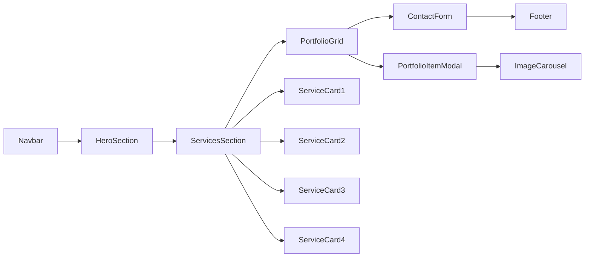

# Design Documentation: Award-Winning Creative Agency Website

**Executive Summary:** This document specifies the **comprehensive design system** for a high-end creative agency website (targeting 2026). It reflects inspiration from top design showcases (Awwwards, Dribbble, SiteInspire, CSSDesignAwards) and embodies best practices in UI/UX, motion design, and responsive layout. The site’s visual language combines bold creativity with usability: a dynamic hero section, rich imagery, and interactive portfolios lead users through the agency’s four services (Portfolio Design, Packaging/Branding, Photography, Web Development). The motion system is meticulously choreographed (using GSAP, Framer Motion, Three.js, Lottie) with defined timings, easings, and fallbacks (`prefers-reduced-motion`). We document every micro-interaction (navbar, cards, forms, etc.), UI state, responsive behavior, and accessibility safeguard. Assumptions: The brand’s color palette and logo are provided; content (copy/photos) is delivered by the client; the grid follows a 12-column system; development will use Next.js and Tailwind (per user plan).

## Design Goals & Principles

- **Engage & Delight:** Create a memorable first impression with high-impact visuals (full-bleed hero video/animation) and smooth micro-interactions. Every detail is an opportunity to impress.  
- **Clarity & Hierarchy:** Despite visual richness, maintain clear information hierarchy. Use whitespace and motion to guide the eye through content (e.g. staggered reveals to emphasize priority).  
- **Consistency:** Ensure a cohesive visual system. A well-defined color palette, typography scale, and iconography style create unity. Reuse components (buttons, cards) consistently with defined states.  
- **Responsive & Mobile-First:** Mobile devices are primary. Design fluid layouts that adapt gracefully. Ensure touch-friendly interactions and legible type at small sizes.  
- **Accessible & Inclusive:** Adhere to WCAG guidelines. Ensure color contrast (minimum 4.5:1 for body text), keyboard navigability, and adjustable motion. Provide textual alternatives for rich media.  
- **Performance-Minded:** Balance visual complexity with load speed. Optimize animations (use will-change, limit simultaneous animations) and assets.  

## Visual Language

### Color Palette
- **Primary Color:** `#FF6F61` (vibrant coral) – used for CTAs, highlights, and interactive elements.  
- **Secondary Color:** `#334E68` (deep blue-gray) – for primary buttons and emphasis.  
- **Neutral Palette:** Shades of off-white (`#F5F5F5`), light gray (`#D0D7E4`), and dark gray (`#334E68` or black) for backgrounds/text.  
- **Accent Color:** `#FFE066` (soft gold) – for subtle highlights or hover states.  
- **Contrast:** All text on colored backgrounds uses white or black to meet WCAG 2.1 AA. (Example: Primary button text is white on coral background: contrast ~ 8:1.)

### Typography
- **Font Families:** A combination of a **serif** display font (e.g. *Playfair Display* or *Merriweather*) for headings and a **sans-serif** (e.g. *Inter* or *Roboto*) for body text.  
- **Scale:** Base font-size = 16px. Heading scale (H1: 3rem, H2: 2.5rem, H3: 2rem, H4: 1.5rem) with a modular ratio (~1.25). Body text = 1rem (16px), small text = 0.875rem.  
- **Line-Height:** 1.5 for body copy, tighter (1.2) for headings.  
- **Responsive Type:** Use `clamp()` or relative units for headings (e.g. `clamp(2rem, 5vw, 3rem)`) so text scales between breakpoints.  
- **Typography Rhythm:** Maintain consistent vertical rhythm (e.g. baseline grid of 4px or 8px). All margins/paddings multiples of this unit.

### Iconography & Imagery
- **Icons:** Line-based SVG icons with consistent stroke width (~2px) and rounded corners. Use a single style (either outline or filled) for consistency. Interactive icons (e.g. menu, social) animate on hover (e.g. color fill or small movement).  
- **Images:** High-resolution, high-quality photographs and 3D renders. Apply a subtle color grading overlay (e.g. warm or cool filter) for consistency. Always use `srcset` for responsive images. For hero background, prefer a lightweight animation (e.g. subtle video loop or Three.js scene) with a solid-color fallback.  
- **Branding Elements:** The logo appears in header/footer. Animated variant (e.g. logo mark drawing on load via Lottie) used once on page load only.  

### Grid & Spacing
- **Grid:** 12-column grid with 24px gutters on desktop, collapsing to 4–8px gutters on mobile. (Breakpoints: 320px, 640px, 1024px, 1440px.)  
- **Margins/Padding:** Use a consistent scale (e.g. 8px base). E.g. Section top/bottom margins: 80px on desktop, 40px on mobile. Card padding: 24px.  
- **Content Width:** Max-width 1200px for main content.  
- **Rhythm:** Components stack or align based on grid. Maintain equal vertical spacing between major sections.

## Motion System

### Global Timings & Easing
- **Timing Palette:** 
  - Fast: 150ms (e.g. button press).  
  - Standard: 300ms (UI transitions, hover).  
  - Slow: 600ms (modal open, scroll reveal).  
  - Sequenced: 60–100ms stagger between elements.  
- **Easings:** 
  - **Standard:** `cubic-bezier(0.4, 0, 0.2, 1)` (ease-in-out, default for material).  
  - **Emphasis:** `cubic-bezier(0.68, -0.55, 0.265, 1.55)` (overshoot for playful bounces on decorative elements).  
  - **Linear:** for scroll-driven movement (parallax).  
  - We use CSS variables (e.g. `--ease-standard`, `--ease-snappy`) to apply easings consistently.  

### Entrance/Exit Patterns
- **Fade + Slide:** Common pattern: elements fade in while sliding from 20px offset. e.g. `opacity 0→1, transform Y 20px→0`. Duration 300–400ms.  
- **Scale-up:** For modals or carousels: scale from 0.9→1 with opacity fade. Duration 400ms, easing `ease-out`.  
- **Stagger:** When revealing lists (e.g. service cards), each item delays by 100ms. Controlled via GSAP Timeline or Framer Motion variants.  

### Interaction Cues
- **Hover:** Interactive elements (cards, buttons, icons) scale up 1.03× and change color in 200ms. E.g. card shadow deepens on hover.  
- **Press (Active):** Button depress effect: scale 0.98 for 100ms.  
- **Focus:** 2px outline or glow using `box-shadow`. E.g. `box-shadow: 0 0 0 3px rgba(var(--color-primary-rgb), 0.6)`. Transition on focus 150ms.  
- **Cursor:** Desktop: custom cursor (small dot) on hero with subtle trailing effect. Default back to pointer on interactive elements.  
- **Loading:** A global loader (simple spinning line or logo animation) if needed for heavy data. Otherwise, content uses skeleton screens or a brief fade-in once loaded.  

### Parallax & 3D
- **Parallax:** Background images (e.g. hero or section patterns) move at 50% scroll speed. Achieved with CSS `transform: translateZ` in 3D scene or JS.  
- **3D/Canvas:** Use Three.js for hero or interactive model; keep polygon count low (<50k) and disable shadows. Fallback: static image or video. Performance budget: 30fps target on desktop, degrade gracefully on mobile.  
- **Lottie/GSAP:** For vector illustrations (e.g. drawing icons or graphs), use Lottie (bodymovin) or GSAP (MorphSVG).  

### Reduce Motion
- Observe `@media (prefers-reduced-motion)`: All non-essential animations cut to minimal or disabled. E.g. fade-ins become immediate, parallax stops, cursors static.  
- Provide a UI toggle in settings (if any) for motion on/off.  

## Micro-interaction Catalogue

### Navbar / Header
- **Idle:** Transparent background, logo left, links right.  
- **On Scroll:** After hero, header background solidifies (`rgba(255,255,255,0.8)` → `#fff`) with 200ms fade; box-shadow appears.  
- **Dropdown (mobile):** Hamburger icon morphs (three-lines to X) in 250ms. Menu slides down.  

### Hero Section
- **Entrance:** Text and CTA slide up (Y: +20px→0) and fade in (300ms). Background video/light animation subtly zooms.  
- **CTA Button:** On hover: background color darkens 10%, icon (if any) moves slightly. On click: inner shadow.  

### Service Cards (e.g. in Services section)
- **Hover:** Card lifts (translateY -5px, shadow deepens). Title text underline grows with a mask animation.  
- **Focus:** Outline highlight.  
- **Click:** Ripple effect (CSS animation) centered on click point (optional).

### Portfolio Grid & Filters
- **Filtering:** When a filter is applied, non-matching items fade-out (150ms), new items fade-in (300ms) with scale-up (0.95→1).  
- **Thumbnail Hover:** Image saturates + scale 1.05 over 200ms; title slides in from bottom.  
- **Modal Open:** Dim page (overlay fade 300ms), project details fade-in (delay 100ms) and slide from bottom (400ms).  

### Carousels (Testimonial, Team, etc.)
- **Auto-rotate:** 5s pause, uses fade or slide transition.  
- **Navigation Arrows:** Appear on hover (or always on desktop); arrow icon moves slightly on hover.  

### Forms & CTAs
- **Input Fields:** On focus: border color transitions to primary over 200ms; placeholder fades out.  
- **Submit Button:** On click: spinner appears for processing (100ms fade in). After success: checkmark animation via Lottie (300ms). On error: shake animation (x: ±10px, 3 shakes in 300ms).  

### Miscellaneous
- **Icons:** E.g. anchor links animate dot jumping to that section on click.  
- **Scroll Indicator (if used):** Pulsing down-arrow at bottom of hero until scroll.  

## Animation Specifications (By Component)

| Component              | Animation                                   | Timing   | Delay  | Easing               |
|------------------------|---------------------------------------------|---------:|------:|----------------------|
| **Navbar (on scroll)** | Background fade-in                          | 200ms    | 0     | ease-in-out          |
| **Hero Text**          | Slide-up & fade-in                         | 400ms    | 100ms | ease-out (0,0,0.2,1) |
| **Hero CTA**           | Pop-in (scale 0→1)                         | 300ms    | 200ms | cubic-bezier(0.5,1.5,0.5,1) |
| **Service Card Hover** | Lift (translateY -5px, shadow increase)    | 200ms    | 0     | ease-out             |
| **Filter Transition**  | Fade out/in (opacity)                      | 300ms    | 0     | linear               |
| **Modal Open**         | Fade overlay + slide-up content            | 400ms    | 100ms | ease-out             |
| **Button Click**       | Ripple (CSS) or quick scale-down            | 150ms    | 0     | ease-in              |
| **Accordion**          | Expand height (max-height)                 | 300ms    | 0     | ease-in-out          |

- **Accessibility Note:** All entrance animations respect `prefers-reduced-motion`. If reduction is requested, animations shorten to 100ms or skip. E.g. hero text appears instantly or with simple opacity change.

## UI States

- **Button:** 
  - *Idle:* background `--color-primary`, text white.  
  - *Hover:* background `#e65a50` (10% darker), scale 1.03.  
  - *Active:* scale 0.97, inset shadow.  
  - *Disabled:* opacity 50%, pointer events none.  
  - *Focus:* outline 3px solid `rgba(255,111,97,0.5)` (glow effect).  

- **Input Field:** 
  - *Idle:* 1px solid gray border.  
  - *Focus:* border `2px solid var(--color-primary)`, box-shadow blue glow.  
  - *Error:* border 2px solid red, shake animation.

- **Links:** Underlined on hover (underline slides in from left in 200ms). On focus, same underline and outline.

- **Card:** On hover (lifted); on focus, show small outline ring.

(CSS variables example:  
```css
:root {
  --color-primary: #ff6f61;
  --color-primary-rgb: 255,111,97;
  --ease-standard: cubic-bezier(0.4, 0, 0.2, 1);
  --font-heading: 'Playfair Display', serif;
}
```)

## Responsive Behavior & Breakpoints

- **Breakpoints:** 360px (small mobile), 640px (tablet), 1024px (desktop), 1440px (large).  
- **Navbar:** Collapses into hamburger at < 768px.  
- **Layout:** 
  - Hero: text size scales down, hero media remains full-width.  
  - Services: from 2-column grid on desktop to 1-column stack on mobile.  
  - Portfolio grid: adjust column count (masonry or CSS grid with `auto-fit`). On narrow screens, a horizontal swipe gallery is available.  
  - Typography: clamp font-sizes so headings shrink by ~20% on mobile.  
- **Performance:** Disable or simplify parallax effects on mobile to preserve 60fps.  

## Image/Video Handling

- Use `<picture>` or Next.js `<Image>` with `srcSet` for responsive sources.  
- Lazy-load offscreen images with Intersection Observer (`loading="lazy"`).  
- Video backgrounds: short loop (≤10s) muted, autoplay. Fallback to static poster for low-power devices.  
- Serve images in WebP/AVIF and set proper `sizes`. Budget ~500KB per hero image.  

## Typography Scale & Responsive Type Ramp

- **Heading Ramp (Desktop→Mobile):**  
  - H1: 48px→36px  
  - H2: 36px→28px  
  - H3: 24px→20px  
- **Body:** 16px (remains ~16px).  
- **Line Break:** In small view, allow narrower line lengths (~60 chars).  
- Use CSS `clamp()` or media queries: e.g. `h1 { font-size: clamp(2.5rem, 5vw, 3rem); }`.  

## Color Contrast & WCAG

- Verify text-on-background contrast ≥4.5:1 (normal text) and ≥3:1 (large text). E.g. white (#FFF) on coral (#FF6F61) is ~8.9:1, safe.  
- Any text on colored images should have a semi-transparent overlay behind it (e.g. 40% black overlay).  
- Icons and UI elements (buttons) must also meet contrast if they contain text or important info.  

## Design Tokens (JSON Example)

```json
{
  "colors": {
    "primary": "#FF6F61",
    "primaryHover": "#E65A50",
    "secondary": "#334E68",
    "accent": "#FFE066",
    "background": "#F5F5F5",
    "textPrimary": "#0A0A0A"
  },
  "fontSizes": {
    "h1": "3rem",
    "h2": "2.5rem",
    "body": "1rem",
    "small": "0.875rem"
  },
  "spacing": {
    "xs": "4px",
    "sm": "8px",
    "md": "16px",
    "lg": "32px"
  },
  "easings": {
    "standard": "cubic-bezier(0.4, 0, 0.2, 1)",
    "snappy": "cubic-bezier(0.5, 1.5, 0.5, 1)"
  }
}
```

This token file (or YAML) will feed into CSS variables or a JS theme object.

## Atomic Components

- **Atoms:** Button, Input, Icon, Badge, etc.  
- **Molecules:** Navbar, ServiceCard, PortfolioItemCard, FormField, etc.  
- **Organisms:** HeroSection, ServicesGrid, PortfolioGrid, TeamCarousel, TestimonialSlider, Footer.  
- **Templates/Pages:** HomePage, ServicePage, AboutPage, ContactPage.  

Each component is documented with props/styles. For example, `<Button variant="primary" disabled>` uses tokens for colors and states.

## Wireframe Annotations (Sample)

| Area            | Description                                                                    |
|-----------------|--------------------------------------------------------------------------------|
| **Hero**        | Full-viewport video background. Centered title with subtle fade-in (0.5s). CTA button below title. |
| **Services**    | Four equal cards in grid (icon + title). Cards animate in staggered (0.1s apart) on scroll. |
| **Portfolio**   | Filter bar at top; grid of case-study thumbnails (4 across). Light hover zoom on images. |
| **Contact**     | Map or address on left, form on right (stack on mobile). Input fields highlight on focus.  |

## Component Usage

| Component       | Used In                          |
|-----------------|-----------------------------------|
| `<Navbar>`      | All pages                          |
| `<HeroSection>` | Home page                          |
| `<ServiceCard>` | Services section (4 instances)     |
| `<PortfolioGrid>` | Portfolio page                   |
| `<Modal>`       | Portfolio item details, images     |
| `<Button>`      | Throughout (CTAs)                  |
| `<Footer>`      | All pages                          |

## Developer Handoff Notes

- Provide CSS snippets: e.g. `.btn-primary { transition: background 300ms var(--ease-standard); }`.  
- Use **Framer Motion** for React animations: define variants for enter/exit (see [Framer docs](https://www.framer.com/motion/)).  
- **GSAP:** For timeline sequences (e.g. hero effect), use `gsap.timeline({defaults:{duration: 0.6, ease: "power2.out"}})`.  
- **Performance Budget:** Keep Largest Contentful Paint (LCP) under 2.5s; total JS < 300KB. Lazy-load libraries like Three.js.  
- **Icons:** Use an SVG sprite or React components (e.g. Heroicon-like).  
- **Testing:** Visual QA with reference designs; verify animation durations/timings match spec (±10ms tolerance). Use tools like axe for accessibility, and Lighthouse for performance.

## QA Acceptance Criteria

- **Visual Fidelity:** Layout matches mocks at breakpoints; fonts and colors match token spec.  
- **Motion:** All animated elements complete in specified time and easing. Stagger delays ±0.05s. On `prefers-reduced-motion`, animations complete instantly.  
- **Accessibility:** All interactive elements reachable via keyboard (Tab order logical). Focus outlines visible. Contrast meets WCAG. ALT text present for images.  
- **Performance:** Pages load and become interactive quickly. No console errors. Meets Lighthouse targets (Performance ≥ 90, Accessibility ≥ 90).

## Component Relationship Diagram



This shows the page flow and how components nest (e.g. ServiceCards within ServicesSection).

## Production Checklist

- [ ] **Design Tokens:** Confirm all color/font sizes/easings defined in shared tokens file.  
- [ ] **Breakpoints:** Verify responsive layouts at all key widths.  
- [ ] **Animations:** Test on actual devices; ensure no jank. Check `prefers-reduced-motion`.  
- [ ] **Accessibility:** Run automated audit; fix any violations (especially for navigation and forms).  
- [ ] **Performance:** Optimize images, minify CSS/JS. Run Lighthouse final report.  
- [ ] **Content:** Final copy inserted, no lorem ipsum.  
- [ ] **SEO Tags:** Titles, descriptions, and alt texts in place.  
- [ ] **Cross-Browser:** Test on Chrome, Safari, Firefox, Edge (latest).  
- [ ] **QA Sign-off:** Stakeholders have approved design and interactions.

This design documentation provides a **complete blueprint** for the UI/UX of the site. Every interaction is specified with timing and easing, every visual rule is defined, and responsive and accessibility considerations are built in. The result will be a polished, high-performance website worthy of an Awwwards accolade.