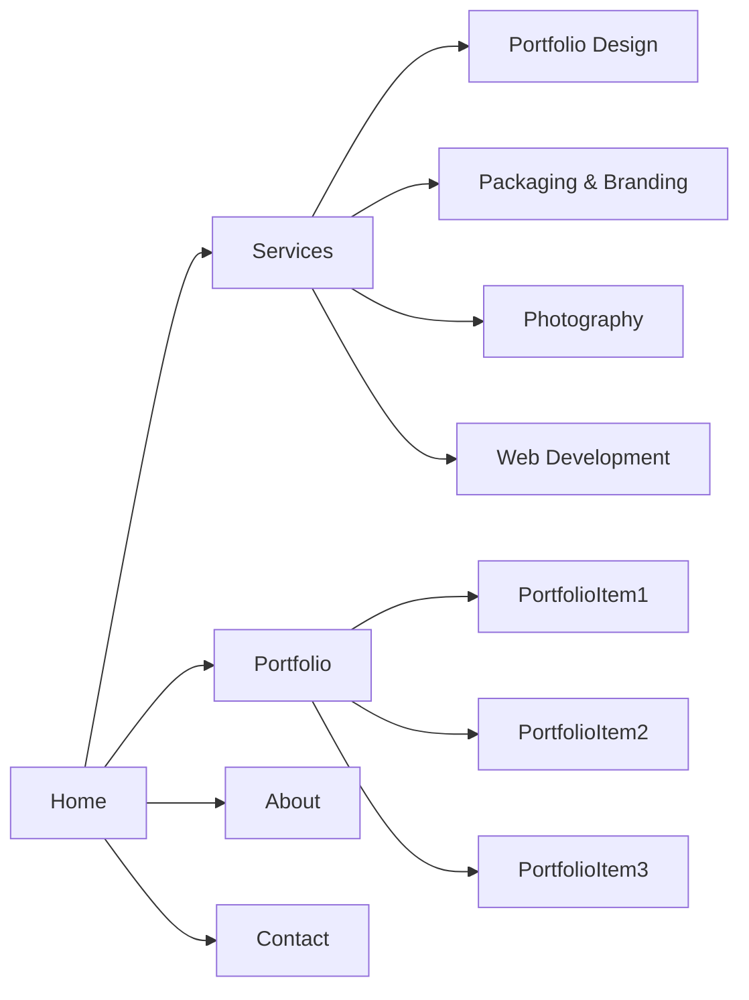
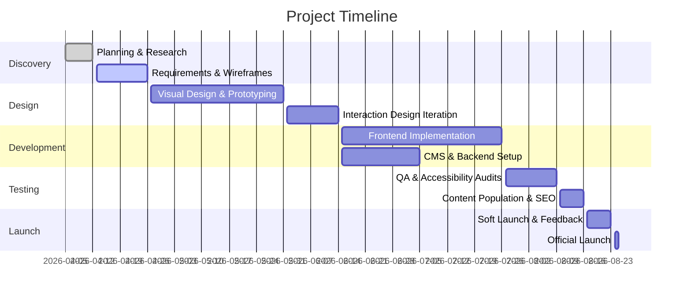

# Product Requirements Document (PRD): Creative Agency Website

**Executive Summary:** This PRD outlines the vision and requirements for a cutting-edge agency website (launch target 2026) showcasing four service verticals: Portfolio Design, Packaging & Branding, Photography, and Web Development. The site will be a fully interactive, award-caliber experience inspired by top designs on Awwwards, Dribbble, SiteInspire, and CSSDesignAwards. Key goals are to demonstrate creative excellence and drive qualified leads. Success will be measured by metrics such as user engagement (low bounce rate, high session duration), SEO rankings for targeted keywords, conversion rate on contact forms, and performance (Core Web Vitals). **Assumptions:** content (images/text) will be provided by client; target market is global and English-speaking; the budget allows for high-quality custom development and animations. (Preferred sources for design inspiration: Awwwards, Dribbble, SiteInspire, CSSDA – reviewed first.)

## Goals & Success Metrics (KPIs)

- **Brand Authority:** Achieve “site of the day” or award recognition (e.g. Awwwards) within 2026 by demonstrating top-tier design. *KPI:* Recognition in at least one major design awards list.  
- **Lead Generation:** Convert visitors into inquiries. *KPI:* ≥5% conversion rate on contact form, with ≥50 qualified leads/month in first year.  
- **Engagement:** High user engagement with site content. *KPI:* Bounce rate < 40%; average session duration > 2:00.  
- **SEO Performance:** Rank on page 1 for key terms (e.g. “event portfolio design agency”, “creative packaging design”). *KPI:* Domain Authority > 30; increase organic traffic by 50% in 6 months.  
- **Performance:** Fast load times. *KPI:* Core Web Vitals: LCP < 2.5s, FID < 100ms, CLS < 0.1.  

## Target Users & Personas

1. **Event Planner Elena (Age 30-45):** Needs creative *portfolio/event design* for weddings or corporate anniversaries. Tech-savvy professional, browses inspirational sites like Pinterest/Awwwards. Values visual storytelling and timeliness.  
2. **Product Manager Priya (Age 25-40):** Seeks *packaging & branding* for a consumer product line. Decisive, detail-oriented, active on Behance/Dribbble. Emphasizes brand consistency and market impact.  
3. **Start-up Founder Alex (Age 25-35):** Requires *professional website* and brand identity. Budget-conscious, familiar with tech trends, looks for innovative design (follows SiteInspire). Prioritizes scalability and ROI.  
4. **Marketing Director Michael (Age 35-50):** Needs *event photography* and branding for large campaigns (often outside India). Corporate background, expects a polished process and global quality.  

Each persona will browse the site to find relevant service info, review portfolios, and contact the agency.  

## User Journeys and Flows

- **Journey 1 (Elena, Portfolio Design):** Elena lands on Home → sees featured event portfolio animation → clicks “Our Work” → filters portfolio by “Event” → views portfolio case study → fills contact form under Portfolio → receives confirmation email.  
- **Journey 2 (Priya, Packaging & Branding):** Priya navigates to Services → hovers over “Branding” section (interactive mockup animation) → clicks “Learn More” → reads about packaging process → downloads a PDF brochure (call-to-action) → schedules a call via booking widget.  
- **Journey 3 (Alex, Web Dev):** Alex visits Home on mobile → views hero animation showing previous website projects → taps “Websites” section → swipes through site thumbnails → selects one and views details in lightbox → clicks “Get a Quote” → triggers contact modal form.  
- **Journey 4 (Michael, Photography):** Michael enters via a Google search → goes to Photography section → sees 360° panorama of an event → scrolls through photo gallery → clicks photographer bio (About) → uses “Call Now” sticky button on mobile to reach agency.  

Each journey maintains focus on *clarity, speed, and engagement*. Interactive elements guide users (e.g. animated arrows, sticky CTA buttons) while providing easy back-navigation.  

## Features (MVP & Roadmap)

**MVP Features:** 
- Multi-section **Homepage** with hero animation and quick links to services.  
- **Services** page/section detailing the four verticals (Portfolio, Branding, Photography, Web).  
- **Portfolio Gallery** with filtering (e.g. by category: Event, Product, Corporate).  
- **Case Study Pages** (modal or separate) for selected portfolio items (image sliders, project details).  
- **About Page** with agency mission and team info.  
- **Contact Page/Form** (and sticky footer contact info).  
- Responsive design (mobile-first) and basic SEO meta tags on all pages.  
- Smooth transitions and scroll animations (using GSAP/Framer Motion).  
- Integration with a Headless CMS (e.g. Sanity/Contentful) for easy content updates.  

**Phase 2 / v1 Additions:**  
- **Blog/Insights Section** for thought leadership (improves SEO).  
- **Client Login Portal** (if needed for proofing or project management).  
- **Multi-language Support** (if target markets expand beyond English).  
- **E-commerce Module** (e.g. for selling prints or templates).  
- **Newsletter Signup & Marketing** (capturing leads via email).  

**Future Roadmap:**  
- Interactive 3D elements (advanced Three.js features).  
- AI-driven personalization (e.g. showing relevant portfolio items).  
- Augmented reality preview (for packaging mockups).  

*Acceptance Criteria:* Each feature listed above will have defined tests, e.g. the contact form must successfully email submissions (test by submitting dummy data), portfolio filters must show correct items, etc.  

## Page-by-Page Requirements

### Home Page
- **Content:** Full-screen hero (cinematic background video or animation) with agency tagline and “Enter Site” button. Brief intro statement. Highlights of four services (icon+title). Footer with social links.  
- **Interactions/Animations:** Hero overlays fade-in text. Scroll triggers reveal of service icons (each icon has hover animation). Parallax background layers for depth.  
- **Accessibility:** Text alternatives for hero (e.g. descriptive <h1> for animation content), skip-navigation link, keyboard focus for all interactive elements.  
- **SEO:** `<title>`, `<meta description>` emphasizing “creative portfolio design, packaging, photography, web development”. Structured data (Organization schema).  

### Services Section
- **Content:** Four panels or cards (Portfolio Design, Packaging, Photography, Web Dev) each with image, brief description, and “Learn More” link.  
- **Interactions:** On hover, cards slightly elevate and show a subtle graphic animation (e.g. overlapping mockup appears). Clicking expands or scrolls to sub-section.  
- **Animations:** Fade-in each card sequentially on scroll. Optional video background snippet for one panel (e.g. photography).  
- **Accessibility:** Ensure contrast meets WCAG AA. Headings for each service. ARIA labels for interactive elements.  
- **SEO:** Each service panel links to anchor with id (for direct linking). Descriptive headings (e.g. “Portfolio Design Services”).  

### Portfolio (Case Studies)
- **Content:** Gallery of project thumbnails (masonry or grid). Categories filters (All, Event, Branding, Web, Photo). Each item has title overlay on hover.  
- **Interactions:** Filtering animates items in/out. Clicking a thumbnail opens a modal/case study or navigates to a project page.  
- **Animations:** Smooth fade and scale transitions when filters change. Horizontal scroll possible on mobile for gallery.  
- **Accessibility:** Each thumbnail has alt text. Modal close on Esc and focus trap inside modal.  
- **SEO:** Add schema “ItemList” or “Gallery”. Each project has its own URL (or anchor), so it’s indexable. Use `<picture>` for responsive images.  

### Project/Case Study Pages
- **Content:** Large project title, hero image, problem/process/solution text. Galleries or carousels of images/videos. Key features or results as bullet points.  
- **Interactions:** Carousel with Prev/Next, image lightbox. Scroll-activated animations (e.g. number counters for metrics).  
- **Animations:** Lazy-load images. Subtle reveal (e.g. slide-in text).  
- **Accessibility:** Descriptive image alt text. Pause animation on focus shift.  
- **SEO:** Each page has unique `<title>` (project name) and `<meta>`. Use canonical tags.  

### About Page
- **Content:** Agency story, mission, team bios, credentials/awards. Logos of notable clients.  
- **Interactions:** Timeline or parallax storytelling for “Our Journey”. Team photos that flip on hover to show bio.  
- **Animations:** Scroll-activated timeline animations, stat counters.  
- **Accessibility:** Ensure text is readable, ARIA for team biography modals or accordions.  
- **SEO:** Keywords like “creative agency India”, etc.  

### Contact Page
- **Content:** Contact form (Name, Email, Service Interested, Message), office address, phone, email, map.  
- **Interactions:** Form validation inline. On submit, show thank-you message. “Click-to-call” button on mobile.  
- **Accessibility:** Label fields properly, validation messages, fieldset if needed.  
- **SEO:** Add schema for LocalBusiness or ContactPage.  

### Global Requirements
- **Navigation:** Sticky top navbar with logo and links. Hamburger menu on mobile. Smooth scroll to sections. Active link highlighting.  
- **Footer:** Social links, site map links, small copyright.  

## Interaction & Animation Specs

- **Libraries:** Use **GSAP** (GreenSock) for scroll animations and timelines, **Framer Motion** for React component transitions, and **Three.js** for any 3D experiences (e.g. 3D logo animation or interactive model).  
- **Timings/Easings:** e.g. Hero fade-in (1s ease-out), section slide-in (0.6s), element stagger 0.2s. Use easing curves (e.g. power2.out).  
- **Fallbacks:** If no JS, content should remain accessible (e.g. all text is visible, CSS transitions still apply). Provide `prefers-reduced-motion` media queries to disable or simplify non-essential animations【157†L1-L9】. All animations should respect reduced-motion: do not auto-play non-interactive loops (e.g. only animate on user scroll/click).  
- **Examples:** Hover on service icon → animate SVG path (via GSAP). Scroll into view → trigger fade-in + slide-up (Framer Motion). Hero transition to next section → full-section horizontal scroll (CSS scroll-snap).  
- **Accessibility (Reduce Motion):** Implement `@media (prefers-reduced-motion: reduce)` to turn off or shorten animations. Ensure critical info isn’t conveyed by motion alone.  

## Information Architecture & Sitemap

A streamlined multi-page site. **Mermaid sitemap diagram:**  

| Page            | URL Path              | Parent    | Purpose                                    |
|-----------------|-----------------------|-----------|--------------------------------------------|
| Home            | `/`                   | –         | Introduce agency and link to sections      |
| Services        | `/services`           | Home      | Overview of all services                   |
| Portfolio       | `/portfolio`          | Home      | Gallery of case studies/projects           |
| About           | `/about`             | Home      | Agency story, team, credentials            |
| Contact         | `/contact`           | Home      | Inquiry form and contact details           |
| Portfolio Item  | `/portfolio/{slug}`  | Portfolio | Detailed case study page for each project  |
| (Optional) Blog | `/blog`             | Home      | Articles/insights (phase 2)                |
| (Optional) Blog Post | `/blog/{slug}` | Blog      | Individual article page                   |

Each page will have clear header/footer components and consistent navigation.

## Wireframe Annotations

| Section         | Component/Content         | Notes/Behavior                                     |
|-----------------|---------------------------|----------------------------------------------------|
| Hero            | Full-screen background (video/animation) + Title + CTA button | CTA scrolls to Services; animation pausable by user |
| Services Panel  | 4 Service Cards (icon+title+link) | Hover effect (color shift/hover animation)        |
| Portfolio Grid  | Filter tabs + Thumbnails  | Filtering animates; thumbnails open modal          |
| About           | Text content + images     | Timeline or parallax background for story section  |
| Contact Form    | Input fields + Submit     | Inline validation; thank-you modal on success      |
| Global Nav      | Logo + links + menu       | Sticky on scroll; accessible via keyboard         |

(Each component is responsive; tables above serve as guidance for layout and behavior.)

## Component Inventory

| Component         | Description                                             | Usage/Props                              |
|-------------------|---------------------------------------------------------|------------------------------------------|
| `<Navbar>`        | Sticky top navigation with logo and links               | Links (array), logo image                |
| `<HeroBanner>`    | Full-viewport intro with title, subtitle, and CTA       | background media, text, CTA action       |
| `<ServiceCard>`   | Card for each service (icon + title + description)     | icon, title, description, link           |
| `<PortfolioGrid>` | Responsive masonry/grid layout of portfolio items      | items list, filter categories            |
| `<PortfolioItem>` | Detailed case study view (image gallery + text)        | project data (images, text, links)       |
| `<Modal>`         | Lightbox/modal dialog (for images or forms)            | content, close action                    |
| `<TeamCarousel>`  | Carousel of team member profiles                       | members array (photo, name, bio)         |
| `<ContactForm>`   | Form with fields for name, email, service, message     | onSubmit handler, validation rules       |
| `<Footer>`        | Page footer with socials, links                        | social URLs, link items                  |

Each component will be developed with a UI library (if any) or custom React/Tailwind styles. All components follow a design system (defined colors, spacing, typography).

## CMS Data Models (Content Schema)

Content to be managed via headless CMS (e.g. Sanity, Contentful):

| Content Type    | Fields                                         | Type          | Required | Description                         |
|-----------------|------------------------------------------------|---------------|----------|-------------------------------------|
| Service         | Title, Description, Icon Image, Detail Text    | Text, Media   | Yes      | Data for each of 4 services         |
| PortfolioItem   | Title, Slug, Category, Images[ ], Summary, Detail | String, Array | Yes      | Case study entries (projects)       |
| TeamMember      | Name, Photo, Role, Bio                          | String, Media | No       | Optional team listing (About page)  |
| PageMeta        | PageTitle, MetaDescription, OGImage            | Text, Media   | Yes      | SEO meta for each page              |
| Testimonial     | Quote, Author, Role, Photo                     | Text, Media   | No       | (Optional) Client quotes            |
| BlogPost        | Title, Slug, Category, Content (rich text), FeaturedImage, Date | String, Text | No | (Future) Blog entries    |

The schema supports dynamic content updates without redeploy. Image assets will be optimized and delivered via CDN.

## Technical Architecture & Tech Stack

- **Framework:** **Next.js** for hybrid Static Site Generation (SSG) and Server-Side Rendering (SSR), enabling excellent SEO and performance. (Next.js is widely used for high-perf sites and integrates with headless CMS easily.)  
- **Styling:** **Tailwind CSS** for utility-first, responsive styling. Accelerates development and ensures consistency.  
- **Animations:** **Framer Motion** (for declarative React animations) and **GSAP** (for complex timeline and 3D animations). **Three.js** for any required 3D scene or WebGL (e.g. interactive mockups).  
- **CMS:** **Sanity** or **Contentful** (headless CMS) for content management. These allow real-time previews and structured content.  
- **Hosting/CDN:** **Vercel** (optimal for Next.js; provides global CDN, serverless functions for forms). Alternatively **Netlify** with functions.  
- **CI/CD:** GitHub Actions or built-in Vercel pipeline (auto-deploy on push to main branch).  
- **Serverless Functions:** For contact form submissions (via Netlify Functions or Vercel Lambdas) and any small backend logic (e.g. sending email through API).  
- **Analytics/Tracking:** Google Analytics (GA4), Google Tag Manager. If privacy is a concern, alternatives like Fathom.  
- **Error Monitoring:** **Sentry** for runtime error tracking and performance monitoring.  
- **Security:** SSL/TLS (HTTPS by default on Vercel). Use **Cloudflare** (optional) for additional CDN, DDoS protection, and WAF.  
- **Performance:** Next.js Image Optimization, code-splitting, HTTP/2, and caching headers.  

**Justification:** This stack is modern and scalable. Next.js + Tailwind is standard for creative sites (speedy dev + SEO). Vercel/Netlify simplifies deployment with previews. Chosen libraries (Framer, GSAP, Three.js) are industry-standard for rich interactions.

## Performance, Security, and Accessibility Requirements

- **Performance:** Must meet Core Web Vitals (LCP <2.5s, FID <100ms, CLS <0.1). Tools: Lighthouse CI as part of CI. Optimize images (modern formats like WebP), preload critical CSS/fonts, lazy-load below-the-fold. *Acceptance:* Lighthouse score ≥ 90 on Desktop and Mobile.  
- **Security:** OWASP Top 10 mitigations (e.g. input validation on forms, sanitize CMS output to prevent XSS). Use HTTPS everywhere. Regular dependency updates. *Acceptance:* No critical vulnerabilities in audits (npm audit or similar).  
- **Accessibility (WCAG 2.1 AA):** Ensure proper contrast (≥4.5:1 for text), keyboard navigable, ARIA labels for non-text elements, semantic HTML. Test with tools like axe and manual keyboard-only navigation. *Acceptance:* Zero high-severity violations in automated tests; manual test reports are satisfactory.  

## Analytics, Tracking & SEO Plan

- **Analytics:** Implement GA4 to track page views, scroll depth, form submissions. Set up conversion goals (contact form submit). Use Google Tag Manager for flexible tag management.  
- **SEO:** Keyword research for each service. All pages have unique, keyword-rich titles and meta descriptions. Use semantic tags (`<h1>`, `<h2>`). Submit XML sitemap to Google Search Console. Use structured data (JSON-LD): Organization schema on Home, Service schemas on services, Breadcrumb schema on all pages. Ensure mobile-first design (Google now indexes mobile-first)【172†L1-L3】.  
- **Performance SEO:** Fast TTFB via SSR, pre-rendered pages.  
- **Social Sharing:** Open Graph and Twitter Card tags for all pages (images and text).  
- **Monitoring:** Use Lighthouse or PageSpeed Insights to monitor. Weekly SEO audits (checking Google Search Console for errors).

## QA, Testing & Rollout Plan

- **Unit & Integration Tests:** Automated tests for critical components (e.g. contact form validation) using Jest/React Testing Library.  
- **End-to-End Tests:** Tools like Cypress to simulate user flows (e.g. filling form, filtering portfolio).  
- **Cross-Browser Testing:** Test on latest Chrome, Firefox, Safari, Edge, and relevant mobile browsers.  
- **Accessibility Testing:** Automated scan (axe-core) plus manual testing with keyboard and screen reader.  
- **Performance Testing:** Run Lighthouse CI on build; remediate any issues above thresholds.  
- **Beta/UAT:** Internal stakeholders and friendly users test on a staging site. Feedback loop for fixes.  
- **Rollback Plan:** If critical bugs at launch, ability to revert to previous stable version (Git tags) and patch fixes.  

## Timeline & Milestones

**Milestones:** PRD sign-off (mid Apr), Design approved (end May), MVP complete (end Jul), Launch (Aug).  

## Resources & Roles

- **Product Owner:** 1 (defines vision, liaises with client).  
- **Project Manager:** 1 (schedules, tracks progress).  
- **UI/UX Designer:** 1 (high-end visuals, animations).  
- **Frontend Developers:** 2 (React/Next.js, one specialized in animations).  
- **Backend/DevOps:** 1 (CMS integration, serverless functions, deployment).  
- **QA Engineer:** 1 (testing across devices).  
- **Content Copywriter/SEO Specialist:** 1 (writes SEO content).  

Total ~7 core team members. Part-time: Graphic artist for icons/graphics (consult).

## Budget & Risks

| Category       | Low (USD)   | Medium (USD) | High (USD)     |
|----------------|------------:|-------------:|---------------:|
| Design & UX    | $5,000       | $10,000      | $20,000        |
| Development    | $15,000      | $25,000      | $40,000        |
| Animations/3D  | $3,000       | $6,000       | $12,000        |
| CMS/Integration| $5,000       | $8,000       | $12,000        |
| QA & Testing   | $3,000       | $5,000       | $8,000         |
| Hosting/Tools  | $500/yr      | $1,000/yr    | $2,000/yr      |
| **Total**      | ~$31k        | ~$55k        | ~$94k          |

**Risk Assessment:**  
- *Scope Creep:* Mitigation – strict change control (additional features frozen post-sprint).  
- *Performance Issues:* Mitigate via early performance budgets and continuous monitoring.  
- *Accessibility Compliance:* Risk of missing issues; mitigate with dedicated audits and developer training.  
- *Animation Overload:* Might overwhelm users or mobile devices; mitigate by prioritizing essential animations and testing on low-end devices.  
- *CMS Delays:* Content not ready; mitigate by seeding placeholders early.  

## A/B Testing Ideas

1. **CTA Wording:** “Get a Quote” vs “Let’s Talk” (test which yields higher form submissions).  
2. **Portfolio Layout:** Grid vs Carousel on the Portfolio page (measure time-on-page and engagement).  
3. **Hero Animation:** Video loop vs static image (assess impact on bounce rate).  
*(Run tests post-launch with 50/50 split using Google Optimize or similar.)*  

## Launch Readiness Checklist

- [ ] All pages reviewed for responsive design on various devices.  
- [ ] Content finalized and proofread; no placeholder text remains.  
- [ ] SEO meta tags, Open Graph tags set for every page.  
- [ ] Sitemap.xml and robots.txt configured.  
- [ ] Performance tests passing (Lighthouse scores ≥ 90).  
- [ ] Accessibility audit complete (0 critical issues).  
- [ ] Analytics and tracking scripts live and verified.  
- [ ] Forms tested (email delivery confirmed).  
- [ ] Backup of staging and rollback plan documented.  
- [ ] Stakeholder approval obtained for final site.  

This PRD provides a **comprehensive blueprint** for building the website. Each major feature has clear acceptance criteria (e.g. “Contact form submits data and triggers a thank-you message”), and the plan balances creative ambition with technical robustness to ensure a successful, award-worthy launch.