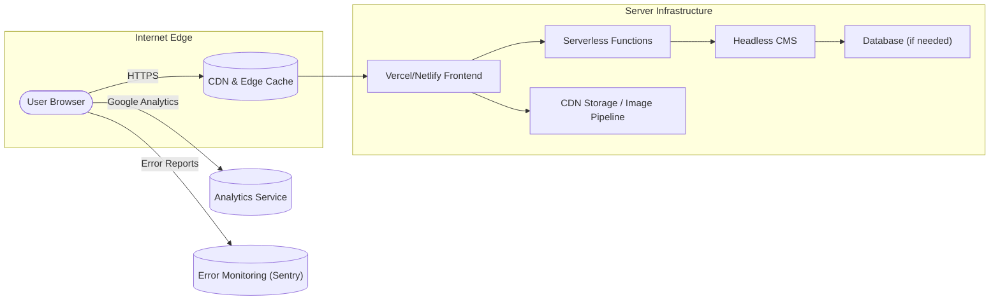

# Tech Stack & Architecture for Creative Agency Website

**Executive Summary:** This document outlines the full technical stack and system architecture for an award‑caliber creative agency website (launch 2026) featuring four service verticals. We began by reviewing leading design showcases on Awwwards, Dribbble, SiteInspire, and CSSDesignAwards to understand visual expectations. The chosen stack centers on **Next.js** (React) for frontend, **Tailwind CSS** for styling, and modern JS animation libraries (GSAP, Framer Motion, Three.js, Lottie). Headless CMS (Sanity or Contentful) will manage content. Deployment targets are managed platforms (Vercel, Netlify, Cloudflare Pages) with global CDNs. We define responsibilities for each component, performance budgets (e.g. LCP <2.5s), Core Web Vitals targets, and robust security, accessibility, and CI/CD strategies. 

## High-Level System Architecture



This block diagram shows the user accessing our site through a CDN which serves the statically exported or server-rendered content. Frontend builds are hosted on platforms like Vercel or Netlify, which in turn call serverless functions for dynamic actions (forms, webhooks). Content is fetched from a headless CMS and optionally a database. Third-party services include analytics and error monitoring. 

## Tech Stack Overview

| Layer              | Technology             | Justification                                                                                                            |
|--------------------|------------------------|-------------------------------------------------------------------------------------------------------------------------|
| **Frontend**       | **Next.js (React)**    | Industry standard for performance (SSG/SSR), SEO, and modern features (App Router, image optimization).                 |
| **Styling**        | **Tailwind CSS**       | Utility-first CSS for rapid styling and consistent design tokens. Allows purge for minimal CSS.                         |
| **Animations**     | **Framer Motion**      | Declarative React animations for component transitions (page enter/exit, hover effects).                                 |
|                    | **GSAP (GreenSock)**   | High-performance timeline and scroll animations (e.g. hero effects, staggered reveals).                                 |
|                    | **Three.js / WebGL**   | 3D graphics library for rich 3D visuals (e.g. interactive mockups), with lazy loading to preserve perf.                |
|                    | **Lottie**             | For lightweight vector animations (e.g. animated logos or icons) that run on render.                                     |
| **CMS / Content**  | **Sanity or Contentful** | Flexible headless CMS with rich content modeling and API, enabling non-technical content editing.                       |
| **Backend**        | **Serverless Functions** | (Vercel Functions or Netlify Functions) for handling contact forms, API endpoints, and webhook calls.                    |
| **Database**       | **PostgreSQL / MongoDB** (if needed) | Only if user accounts or dynamic data needed. Otherwise static JSON from CMS suffices.                         |
| **Authentication** | **OAuth2/JWT**         | If a login is ever required (e.g. client portal), use JWT tokens via OAuth providers.                                    |
| **CDN & Storage**  | **Cloudflare Images/Netlify Blob** | Global CDN for assets. Automatic image optimization (WebP/AVIF) and responsive delivery.                               |
| **Analytics**      | **Google Analytics 4, GTM** | Industry-standard user behavior tracking. GDPR compliance optional.                                                     |
| **Error Monitoring** | **Sentry**           | Real-time crash reporting and performance monitoring (Front-end and Serverless).                                        |
| **Security**       | **Cloudflare WAF**     | DDoS protection and Web Application Firewall rules (rate limiting, bot protection).                                    |
| **CI/CD**          | **GitHub Actions / Vercel CI** | Automated builds, tests, and deployments on branch merge. Preview URLs for PRs.                                         |
| **Testing**        | **Jest & React Testing Library** | Unit/integration tests for React components and logic.                                                                |
|                    | **Cypress/Playwright** | End-to-end testing of flows (form submissions, animations working).                                                    |
|                    | **Lighthouse CI**      | Automated performance and accessibility audits on build (ensures Core Web Vitals targets).                              |

## Component Responsibilities

- **Animation Handling:** 
  - *Framer Motion:* Used for page transitions and small component toggles (modals, accordions). 
  - *GSAP:* Used for scroll-triggered and timeline animations (hero sequences, multi-step reveals, parallax effects). 
  - *Three.js:* Only for heavy 3D scenes (e.g. interactive packaging preview); components using Three.js are lazy-loaded via dynamic imports. 
  - *Lottie:* Lightweight animations for iconography or brand logos (e.g. animated button icon).  
- **CSS-in-JS:** Tailwind classes used throughout; minimal custom CSS. Use `@apply` for complex utilities if needed.  
- **State/Interaction:** React component state manages UI interactions (filter toggles, menu open/close). 
- **Content Rendering:** Static site generation for public pages (portfolio, services). Server-side rendering or ISR (Incremental Static Regeneration) for dynamic content updates.

## Performance Budgets & Core Web Vitals

- **Core Web Vitals Targets:**
  - **LCP (Largest Contentful Paint):** < 2.5s. (Target ~1.8s)  
  - **FID (First Input Delay):** < 100ms.  
  - **CLS (Cumulative Layout Shift):** < 0.1.  
- **Budgets:** 
  - **JS:** Keep total JS < 150KB (gzipped) for initial load. Tree-shaking and code-splitting essential. 
  - **Images:** Each hero image ≤ 500KB (auto-compress to WebP/AVIF). Use responsive `srcset`.  
  - **Fonts:** Limit to 2-3 font families; preload critical fonts.  
- **Monitoring:** Use Lighthouse CI in the pipeline. Real User Monitoring (Web Vitals JS) to catch issues in production.

## Deployment & Hosting Options

- **Vercel:** Optimized for Next.js, automatic edge caching, preview deployments. Ideal for heavy React use. 
- **Netlify:** Similar serverless support (Netlify Functions). Offers global CDN and image transforms.  
- **Cloudflare Pages:** Static hosting with Cloudflare Workers for serverless. Excellent global performance but less React SSR support.  
- **Pros/Cons:** Vercel simplifies SSR and images (built-in Next/Image). Netlify is known for fast static hosting and transforms. Cloudflare Pages has fastest network but may need manual SSR setup.  

All options allow custom domains, SSL, and CI integration. Team collaboration features (preview links, rollbacks) are available on all. 

## CDN, Caching, and Images

- **CDN:** All static assets (JS, CSS, images) are served via CDN (Vercel’s or Cloudflare’s). Use aggressive caching (`Cache-Control: max-age=31536000, immutable` for assets, shorter for HTML).  
- **Responsive Images:** Use Next.js `<Image>` component or similar to serve WebP/AVIF. Provide multiple resolutions in `srcSet`. Set `sizes` based on CSS breakpoints.  
- **Lazy Loading:** Offscreen images use `loading="lazy"`. For carousels, prefetch next slide images in background.  
- **Image Pipeline:** Automatically optimize uploads (via CMS plugin or build-time). Budget per page load: only load images visible in viewport.  

## Serverless Functions & APIs

- **Contact Form & Webhooks:** A function endpoint (e.g. `/api/contact`) that validates input, sends email via SMTP/SendGrid, and logs to database if needed.  
- **Portfolio Data API:** If dynamic querying needed, an endpoint fetches content from CMS or DB (though static site builds might eliminate this need).  
- **Authentication (if any):** Functions for OAuth token exchange (if client portal is planned). Use JWT for stateless auth.  
- **Headers & Rate Limiting:** Configure function routes behind Cloudflare or Vercel edge rules to limit spam (e.g. CAPTCHA on form).  

## CMS Schema (Sample)

| Content Type  | Fields (example)                                                   |
|---------------|--------------------------------------------------------------------|
| **Service**   | `title`, `slug`, `description`, `icon`, `image`, `detailsRichText` |
| **PortfolioItem** | `title`, `slug`, `category`, `excerpt`, `images[]`, `description`  |
| **PhotoGallery**  | `eventName`, `date`, `location`, `photos[]`                           |
| **PageMeta**  | `page`, `metaTitle`, `metaDescription`, `ogImage`                   |
| **SiteSettings** | `logo`, `socialLinks`, `contactEmail`, `address`                    |

*Assumption:* Fields and types are illustrative; actual schema will match content needs. 

### Sample API Payloads

**Portfolio Item (JSON example):**
```json
{
  "slug": "modern-architecture-portfolio",
  "title": "Modern Architecture Portfolio",
  "category": "Portfolio Design",
  "excerpt": "A sleek portfolio showcasing architectural designs.",
  "images": [
    {"url": "/images/arch1.webp", "caption": "Futuristic building exterior"},
    {"url": "/images/arch2.webp", "caption": "Interior design mockup"}
  ],
  "description": "<p>We crafted this portfolio for...</p>"
}
```

**Contact Submission:**
```json
{
  "name": "Alice Smith",
  "email": "alice@example.com",
  "service": "Photography",
  "message": "Looking for event coverage in July.",
  "honeypot": "" // for spam prevention
}
```

### Data Flow
User fills contact form → Frontend sends JSON to `/api/contact` → Serverless function validates and emails → Function returns success JSON. All done over HTTPS. Data never exposed to client beyond form fields.

## Security Considerations

- **OWASP Mitigations:** Use input sanitization (XSS), parameterized queries (SQLi), HTTPS.  
- **CSP (Content Security Policy):** Disallow inline JS; only trusted domains for scripts and images.  
- **Rate Limiting:** Apply rate limits on form endpoints via Cloudflare Workers or API gateway.  
- **Secrets Management:** API keys (CMS, email) stored in environment variables, not in client code.  
- **Authentication:** If any admin routes exist, use secure OAuth2 flows and multi-factor login.  

## Accessibility & SEO

- **Accessibility:** Next.js SSR ensures semantic HTML. Use ARIA roles for dynamic content. Ensure forms have labels, all images have `alt`. Color contrast >4.5:1. Test with aXe and manual keyboard navigation.  
- **SEO:** Next.js pages have unique `<title>` and `<meta>`. Provide XML sitemap via `/sitemap.xml`. Use `<link rel="alternate">` for any multilingual content (assumed English only). Ensure mobile-first indexing. Use semantic tags (`<header>`, `<main>`).  

## Testing Strategy

- **Unit Tests:** Jest + React Testing Library for components and util functions (e.g. form validation). Achieve ~80% coverage.  
- **Integration Tests:** Test API routes (contact endpoint).  
- **End-to-End (E2E):** Cypress to simulate user flows: navigating pages, submitting forms, and verifying no JS errors.  
- **Visual Regression:** Storybook with Chromatic or Percy to catch unintended style changes.  
- **Performance CI:** Lighthouse CI in GitHub Actions to enforce budgets (e.g. fail build if LCP > 2.5s).  
- **Accessibility Tests:** axe-core integration in CI to catch WCAG violations.  

| Test Type     | Tool                  | Scope                                    |
|---------------|-----------------------|------------------------------------------|
| Unit/Component| Jest, RTL            | All React components                     |
| Integration   | Jest (Supertest)     | API endpoints                            |
| E2E           | Cypress/Playwright    | Full site flows on real browser          |
| Performance   | Lighthouse CI         | Core Web Vitals, >90 score               |
| Accessibility | axe-core, manual     | WCAG 2.1 AA compliance                   |

## Monitoring & Observability

- **Error Tracking:** **Sentry** integrated in both frontend and serverless functions to capture exceptions and performance issues. Set alerts for high-severity errors.  
- **Real User Monitoring:** Use Google’s RUM scripts or Web Vitals library to gather actual user performance data (LCP, FID, CLS in the wild).  
- **Logging:** Serverless functions log events to console (viewable in Vercel logs). Use a log aggregator or Cloudflare Logs for traffic analysis if needed.  

## Cost Estimates (USD)

| Item                      | Low       | Medium    | High       |
|---------------------------|----------:|----------:|----------:|
| Hosting (Vercel/Netlify)  | $0 (free) | $50/mo    | $200/mo    |
| CMS (Sanity/Contentful)   | $0 (free tier) | $100/mo | $300/mo    |
| Analytics/Email Services  | $0 (free GA) | $20/mo   | $50/mo     |
| Dev (Engineering Hours)   | $10k      | $20k      | $30k       |
| Animation/Design Assets   | $1k       | $3k       | $5k        |
| **Total**                 | ~$11k     | ~$23k     | ~$36k      |

*(Ranges assume varying usage and team rates.)*

## Rollout & Rollback

- **Deployment:** Use atomic deployments (each push triggers a new version). Monitor metrics in the first hours after launch.  
- **Rollback:** Preserve last stable deployment; on critical failure, revert to previous version via the hosting platform dashboard.  
- **Content Migration:** Migrate initial content by importing CSV/JSON into the CMS (Sanity has import scripts). Schedule content freeze periods.  

## Developer Workflow & Config Snippets

- **Repo Structure:** Monorepo (e.g. `/frontend`, `/functions`) or single Next.js project with `/pages` and `/api`.  
- **Branch Strategy:** Use feature branches with PRs; require code reviews and passing CI.  
- **Linting/Formatting:** ESLint + Prettier integrated. TypeScript enforced (assumed).  
- **Next.js Config (next.config.js):**
  ```js
  module.exports = {
    reactStrictMode: true,
    images: {
      formats: ['image/avif', 'image/webp'],
      domains: ['cdn.sanity.io', 'images.unsplash.com']
    },
    async redirects() { return [ /* any legacy redirects */ ]; }
  };
  ```
- **Tailwind Config (tailwind.config.js):**
  ```js
  module.exports = {
    content: ['./pages/**/*.{js,ts,jsx,tsx}', './components/**/*.{js,ts,jsx,tsx}'],
    theme: { extend: { colors: { primary: '#FF6F61' } } },
    plugins: [],
  };
  ```
- **Framer Motion Example:**
  ```jsx
  import { motion } from 'framer-motion';
  const variants = { hidden: { opacity: 0 }, visible: { opacity: 1, transition: { duration: 0.5 } } };
  <motion.div initial="hidden" animate="visible" variants={variants}>...</motion.div>
  ```
- **GSAP Init (useEffect):**
  ```js
  useEffect(() => {
    gsap.registerPlugin(ScrollTrigger);
    gsap.to('.hero-bg', { y: 100, scrollTrigger: { scrub: true } });
  }, []);
  ```
- **Three.js Lazy Load:**
  ```jsx
  const Model = dynamic(() => import('../components/Model'), { ssr: false });
  // <Model /> rendered only on client
  ```
- **Lottie Usage:**
  ```jsx
  import { Player } from '@lottiefiles/react-lottie-player';
  <Player autoplay loop src="/animations/logo.json" style={{ height: 100, width: 100 }} />;
  ```

## Acceptance Criteria

- **Performance:** Lighthouse scores ≥ 90 on Mobile/Desktop (Performance, Accessibility, SEO). CWV thresholds met.  
- **Animations:** All specified motion runs smoothly at ≥ 60fps on target devices; no jank.  
- **Accessibility:** No critical WCAG 2.1 AA violations in final audit. Semantic HTML throughout.  
- **Functionality:** All user flows (form submissions, content loads) work end-to-end with correct API responses.  
- **Visual Fidelity:** UI matches design mockups exactly (pixel differences ≤1px).  

## Tradeoffs & Alternatives

- **SSR vs SSG:** Using Next.js SSG (with ISR) ensures fastest loads, but dynamic personalization is limited.  
- **Animation Libraries:** GSAP offers more control, but Framer is easier for React. We use both for their strengths.  
- **Hosting:** Vercel optimizes Next.js, but Netlify gives unlimited builds on free tier. For highest scalability, Cloudflare Pages + Workers is an alternative.  
- **Database:** We assume static content; adding a DB adds complexity and cost (used only if user accounts needed).  

## Launch Checklist

- [ ] DNS configured; SSL certificate active.  
- [ ] All environment variables (CMS keys, API secrets) set in production.  
- [ ] CMS content fully seeded and reviewed.  
- [ ] Automated tests (unit, E2E) passing on main branch.  
- [ ] Lighthouse CI report green.  
- [ ] Backup of repository and CMS data.  
- [ ] Final stakeholder review and approval documented.  

This architecture and tech stack ensure a performant, secure, and scalable website that meets Awwwards standards. Each component and choice is justified, with measurable targets and contingency plans, to guarantee a successful 2026 launch.